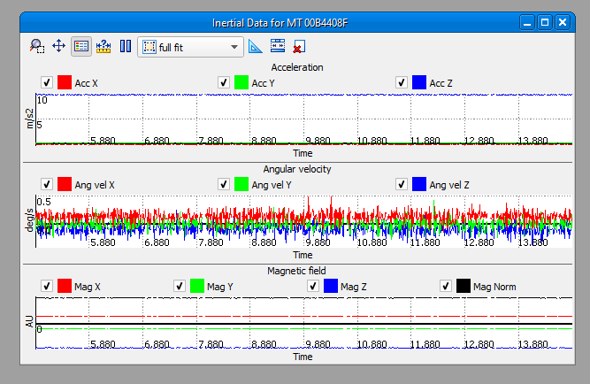
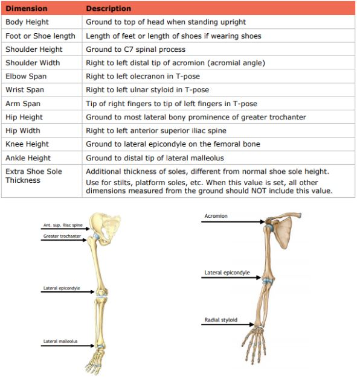
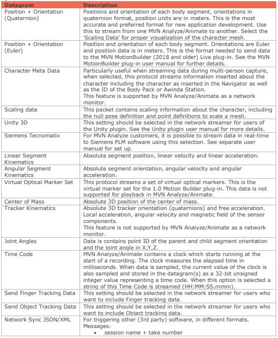
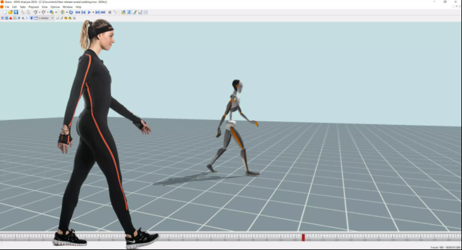

# Recherches et notes Xsens Awinda

## Positionnement des capteurs et mensurations

Le Xsens Awinda offre une captation de données pour le corps en entier en temps réel. L'acquisition de cet équipement vient avec la suite MT Software Suite. Ce dernier inclus MT Manager Software, un logiciel qui permet de visualiser grâce à des graphiques et des modèles 3D les données captées par les MTw.

 Le système de base comprend 6 capteurs pouvant être placés à plusieurs endroits sur le corps de l'utilisateur selon les besoins.

Tableau de placement des capteurs :

Il est important aussi de mesurer la dimension du corps de la personne qui portera les capteurs, puisque cela aura un incidence sur la calibration.

Dans notre cas, qui est la captation de mouvement d'un joueur de piano, nous n'avons pas besoin des capteurs pour le bas du corps puisqu'il sera en position assis. Il est donc possible de mettre les capteurs en mode No-level, ce qui envoie comme message aux capteurs qu'effectivement l'utilisateur restera en position assis pour la durée de la captation. 

## Transfert de données en temps réel

Dans la théorie, il est possible de d'envoyer les données en temps réel à différentes plateformes et sous plusieurs formes selon les options du Network Streamer.

L'option qui nous intéresse dans notre cas est l'option Unity 3D. Cette option nous permet d'utiliser le plugin Unity pour transférer les données en temps réel vers Unity 3D.

Pour ce faire, il faut installer soit le logiciel [MVN Animate](https://www.xsens.com/products/mvn-animate) ou [MVN Analyze](https://www.xsens.com/products/mvn-analyze), puis ajouter le plugin [MVN Live Animation](https://assetstore.unity.com/packages/3d/animations/mvn-live-animation-11338) au projet Unity. 

Il sera alors possible d'utiliser un modèle humain 3D fourni par le plugin. Les capteurs MTw présents sur le corps de l'utilisateur seront liés à ce modèle 3D, chacuns à leur place respective. 

Pour bien commencer avec Unity, il y a un [tutoriel](https://base.xsens.com/knowledgebase/s/article/MVN-Unity-Live-Plugin-2020?language=en_US) de disponible.

## Autres informations pertinentes

Manuel d'utilisation : 
https://www.xsens.com/hubfs/Downloads/Manuals/MVN_User_Manual.pdf?hsCtaTracking=1eacb2ea-b005-43d0-a2b7-55dbf7f6a4f7%7Cb08403d4-214e-42c7-9920-18ab2f35e714

Base de connaissances : 
https://base.xsens.com/knowledgebase/s/motion-capture-landing-page

Base de connaissances pour le plugin : https://base.xsens.com/knowledgebase/s/article/Unity-MVN-Live-Plugin-Overview-1611928803312?language=en_US 