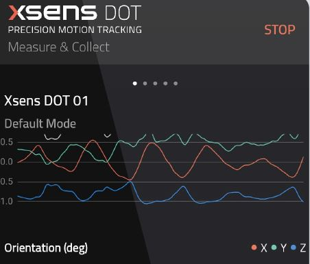

# Recherches et notes XSens DOT

Le système XSens DOT se rapproche énormément du système Awinda, à quelques différences près. Le système DOT comprend 5 capteurs individuels qui permettent de récupérer des données dans un nombre d'application infinies, dont la santé , les sports et l'éducation. Le système de récupération de données est une application android et iOS, mais un SDK est aussi disponible pour le développement sur android studio ou autre.

## Positionnement des capteurs et mensurations

Les capteurs DOT offrent une liberté beaucoup plus intéressante que le système Awinda, car les capteurs peuvent être placés exactement où l'utilisateur a besoin de récupérer les données pour son champs d'expertise. Cela offre une expérience beaucoup plus personnalisée pour chaque cas d'utilisation. Un autre avantage est qu'il n'y a pas de fonction haut du corps et bas du corps, les capteurs fonctionnent avec les positions 3D X, Y et Z, dont le point de départ est établit suite à la calibration du capteur au début ou avant la captation. 

## Transfert de données en temps réel

L'application mobile DOT conçu exclusivement pour les capteurs DOT nous permettent de récupérer les données suivantes : les coordonnées x, y et z, l'accélération en m/s2, la vitesse angulaire en degree/s, le champ magnétique en a.u., et l'orientation, soit en quaternions ou en angles euler. Il n'est pas possible d'envoyer les données en temps réel d'un sytème android ou iOS directement vers un ordinateur. 

Par contre, grâce à leur SDK disponible pour iOS et android, ainsi que le Xsens DOT Server, il est possible, avec un ordinateur possédant une connectivité Bluetooth, de recevoir directement les données sur ordinateur et ensuite les transmettre vers un autre logiciel de son choix.

