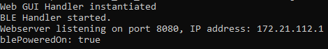
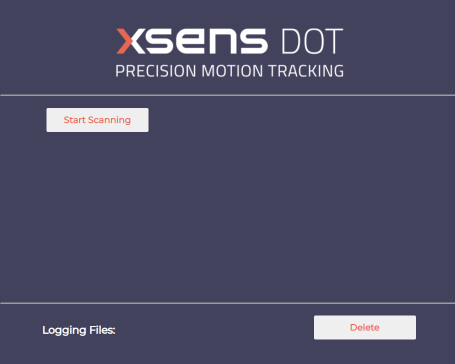
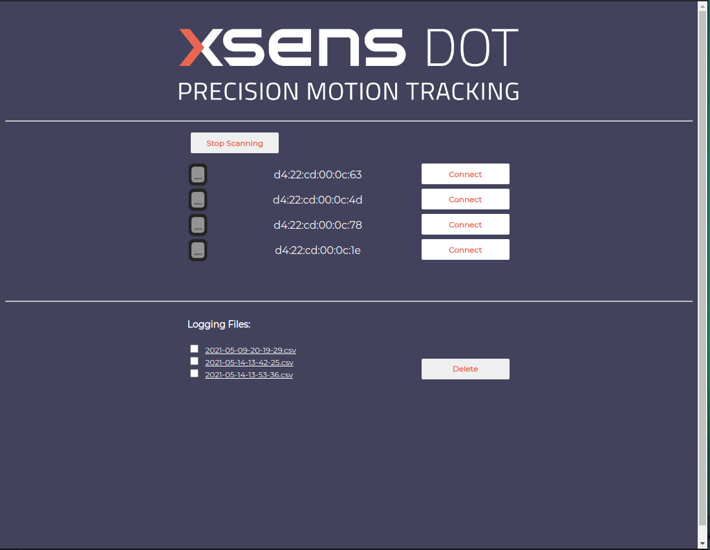
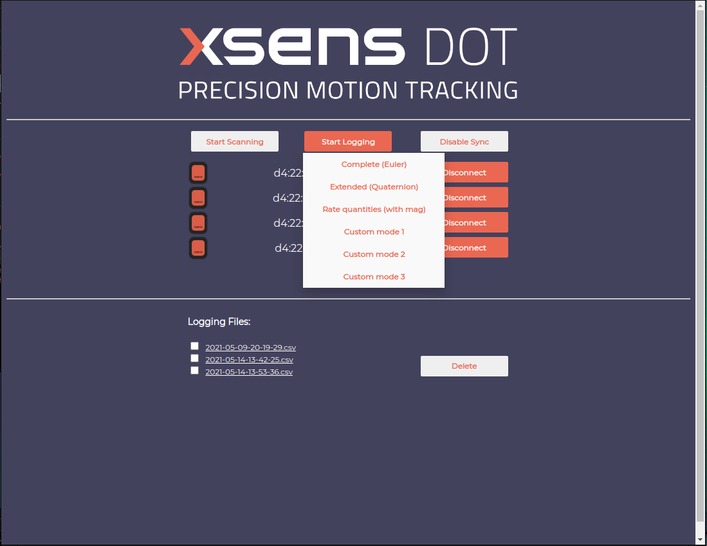
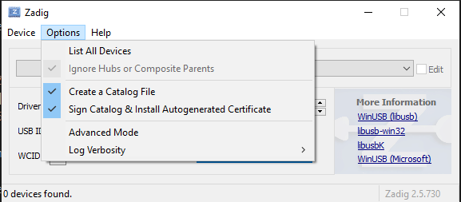
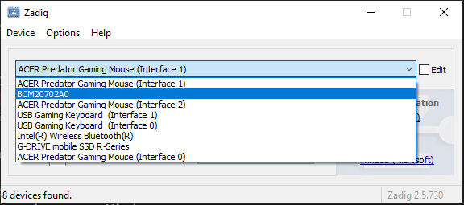

# Fonctionnement et tests des Xsens DOT

## Fonctionnement
Après plusieurs tests, la méthode qui s'est avérée la plus efficace est celle d'utiliser le Xsens DOT Server sur un Raspberry Pi. Les tests et problèmes rencontrés sont disponibles plus bas. 

Avant de commencer, il faut avoir en sa possession un Raspberry Pi 4 Model B 4GB RAM ou un Raspberry Pi 3 Model B+ 1GB RAM. Puis, il faut installer [Raspberry Pi OS](https://www.raspberrypi.org/software/operating-systems/).

Voici les étapes à suivre pour configurer l'environnement du Xsens DOT Server.

1. Ouvrir l'invite de commande.
2. Installer les dépendances requises.
    * Librairie pour utiliser Bluetooth : 

            sudo apt-get install bluetooth bluez libbluetooth-dev libudev-dev

    * Librairie pour pouvoir utiliser les commandes nécessaires et communiquer de façon sécurisée sur Internet :

            sudo apt-get install build-essential checkinstall libssl-dev

3. Télécharger Node.js 8.x.

            curl -sL https://deb.nodesource.com/setup_8.x | sudo -E bash -

4. Installer npm, qui va permettre de gérer les versions de Node à partir de l'invite de commandes.

            sudo apt-get install npm

5. Installer Node.js 8.x.
    * Installer globalement Node.js

            sudo npm install -g n

    * Choisir la version désirée 

            sudo n 8.11.1

    * Vérifier que la version choisie a bien été installée

            node -v

6. Cloner le repo du Xsens DOT Server 

            git clone https://github.com/xsens/xsens_dot_server.git

7. Aller dans le dossier du Xsens DOT Server 

            cd ./xsens_dot_server

8. Installer les dépendances 

            npm install

9. Lancer le Xsens DOT Server

            sudo node xsensDotServer

10. Ouvrir une page sur Chrome ou Firefox et ouvrir le serveur et entrer l'adresse suivante : http://localhost:8080/ 

    
        
11. Cliquer sur *Start Scanning*
    
    

12. Cliquer sur *Connect* pour chaque capteur.
    

13. Cliquer sur *Start Logging* et choisir l'option souhaitée.
    

14. Une fois l'enregistrement terminé, le ficher .csv se trouvera en bas de la page.
    

Les instructions complètes sont disponibles [ici](https://github.com/xsens/xsens_dot_server?__hstc=81749512.53f77f8330742da66857bbcd2501f64e.1617717751116.1622079176520.1622084171852.14&__hssc=81749512.1.1622084171852&__hsfp=3373981959&hsCtaTracking=d055c622-0f36-4452-bcbf-6779ece95f4b%7Cd8bc74b6-b1ba-4fbb-9a5e-d5bcbf7756ed) (en anglais).

## Tests effectués
Voici les tests qui ont été effectués afin de déterminer quelle est la meilleure façon d'utiliser les Xsens DOT.
### Premier essai : Utilisation du Xsens DOT Server avec Windows
Voici les prérequis pour pouvoir utiliser le serveur :
* Windows 7 ou Windows 10
* Adaptateur Bluetooth USB 4.0
* Navigateur Chrome ou Firefox

Étapes à suivre :
1. Installer le logiciel [Zadig](https://zadig.akeo.ie/) (gratuit)
2. Installer [Python 3.8.3](https://www.python.org/downloads/release/python-383/)
3. Installer [Node.js 12.16.2](https://nodejs.org/download/release/v12.16.2/node-v12.16.2-x64.msi)
4. Installer node-gyp en entrant la ligne suivante dans l'invite de commandes:
        
        npm install -g node-gyp
5. Installer les outils nécessaires pour Windows :

        npm install --global --production windows-build-tools

6. Ouvrir Zadig, aller dans l'onglet **Options** et cocher **List All Devices**

    

7. Choisir l'adaptateur Bluetooth

    

8. Appuyer sur **Replace Driver**.
9. Retourner dans l'invite de commandes et cloner le repo
        
        git clone https://github.com/xsens/xsens_dot_server.git

7. Aller dans le dossier du Xsens DOT Server 

            cd ./xsens_dot_server

8. Installer les dépendances 

            npm install

9. Lancer le Xsens DOT Server

            node xsensDotServer

Au final, cette option a été rejetée, car plusieurs problèmes se sont produits lors de la configuration du serveur, ainsi que lors de son utilisation. Voici une liste de ces dits problèmes :
* Lorsqu'il fut le temps de remplacer le driver avec Zadig, l'installation échouait à chaque fois. De plus, après ces manipulations, l'ordinateur utilisé n'avait plus accès au Bluetooth. Une réinitialisation des drivers a été nécessaire.
* Malgré l'utilisation d'un adaptateur Bluetooth, lors de l'ouverture du serveur, aucun capteur n'apparaissait. Après avoir installé et désinstallé le driver de l'adaptateur, seuls deux capteurs du cinq apparaissaient. Après quelques secondes, ils n'étaient plus présents. Le problème pourrait être lié au fait que l'adaptateur est USB.

### Deuxième essai : Utilisation d'un Raspberry Pi
Avec cette méthode, les étapes pour l'installation sont un peu moins nombreuses et elle ne requiert pas l'utilisation d'un adaptateur USB. Après avoir suivi les instructions, les cinq capteurs sont apparus automatiquement sur le serveur. Il a donc été simple et rapide de pouvoir commencer à enregistrer des données.
Le seul problème, qui n'a pas encore été réglé, est que la prise de données ne semble pas se faire en temps réel. Lorsqu'un enregistrement commence, les résultats ne sont pas accessibles tant qu'il est en cours. Par la suite, les données sont fournies sous un fichier au format .csv.

## Éléments à tester

1. Trouver une façon de transmettre les données en temps réel. 
    * Voir si le [node-xsens-dot de njanssen](https://github.com/njanssen/node-xsens-dot) est efficace pour cette tâche. Cela requiert des connaissances en JavaScript.
