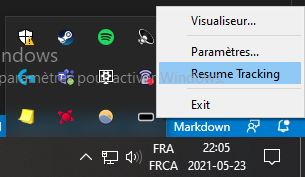
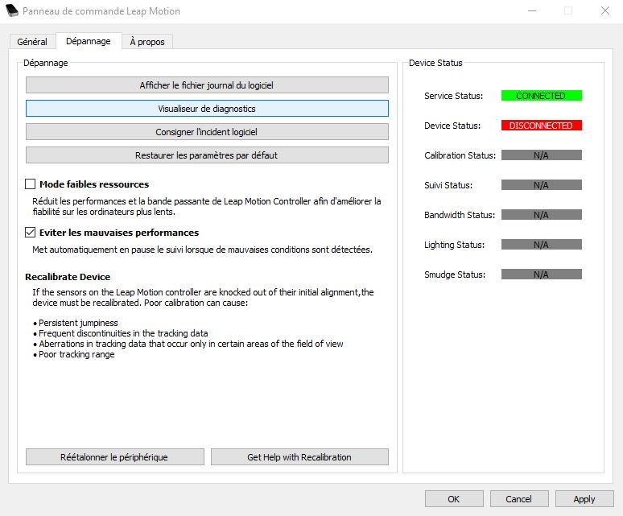
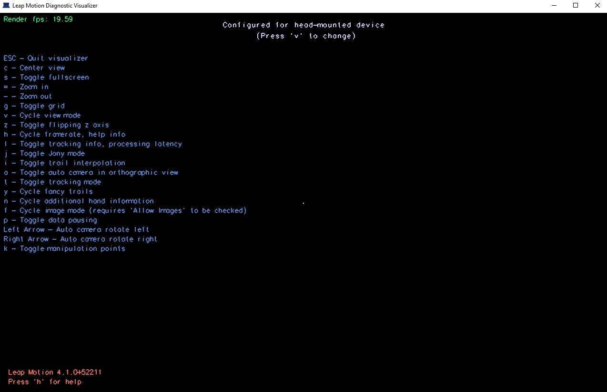
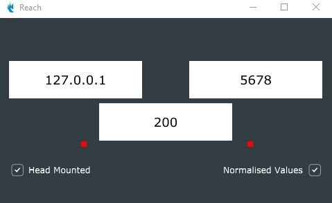
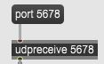
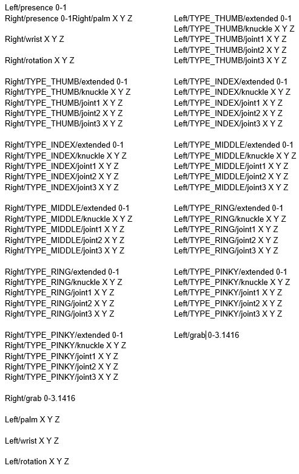

# Fonctionnement et tests du Leap Motion et REACH

## Fonctionnement

Voici les étapes pour utiliser le Leap Motion avec REACH et récupérer les données:

1. Branchez votre Leap Motion à votre ordinateur

2. Téléchargez le Leap Motion Control Panel - https://developer.leapmotion.com/sdk-leap-motion-controller/

3. Activez le Leap Motion en appuyant sur l'icône caché du Leap motion et sélectionnez "Resume Tracking"

4. Allez dans votre Control Panel du Leap Motion, puis dans l'onglet dépannage, cliquez sur "Visualiseur de diagnostic"

5. Appuyez sur "V" jusqu'à ce que la vue soit configuré pour les appareils VR (head-mounted device)

6. Installez REACH à partir du GitHub - https://github.com/NiccoloGranieri/Reach

7. Ouvrez REACH et vérifiez la connection en passant vos mains devant le capteur. Si vous voyez les lumières rouges passer au vert, la connection est bonne, si non il vous faudra peut-être redémarrer votre ordinateur.

8. Cochez les cases "Head Mounted" ainsi que "Normalised Values"

9. Dans l'application de votre choix (ici Max/MSP), vous pouvez utiliser le port et/ou l'adresse IP de REACH (ici le port) pour transmettre les données

10. Voici la liste de données qui vous sera alors transmis par REACH

## Éléments à tester

1. ...

Descritpion test
Résultat

2. ...

Descritpion test
Résultat

3. ...

Descritpion test
Résultat
