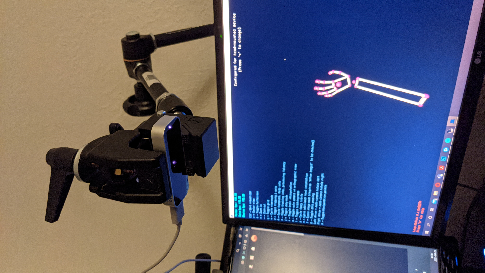
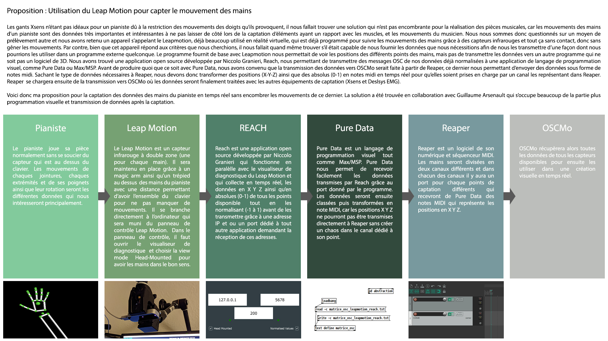

# Fonctionnement et tests du Leap Motion et REACH

## Fonctionnement

Voici les étapes pour utiliser le Leap Motion avec REACH et récupérer les données:

1. Branchez votre Leap Motion à votre ordinateur

2. Téléchargez le Leap Motion Control Panel - https://developer.leapmotion.com/sdk-leap-motion-controller/

3. Activez le Leap Motion en appuyant sur l'icône caché du Leap motion et sélectionnez "Resume Tracking"

    

4. Allez dans votre Control Panel du Leap Motion, puis dans l'onglet dépannage, cliquez sur "Visualiseur de diagnostic"

    

5. Appuyez sur "V" jusqu'à ce que la vue soit configuré pour les appareils VR (head-mounted device)

    

6. Installez REACH à partir du GitHub - https://github.com/NiccoloGranieri/Reach

7. Ouvrez REACH et vérifiez la connection en passant vos mains devant le capteur. Si vous voyez les lumières rouges passer au vert, la connection est bonne, si non il vous faudra peut-être redémarrer votre ordinateur.

8. Cochez les cases "Head Mounted" ainsi que "Normalised Values"

    

9. Dans l'application de votre choix (ici Max/MSP), vous pouvez utiliser le port et/ou l'adresse IP de REACH (ici le port) pour transmettre les données

    

10. Voici la liste de données qui vous sera alors transmis par REACH
    
    

## Éléments à tester

1. Premier Test : Voir si le capteur Leap Motion peut être utilisé visant vers le bas en position fixe

    Dans notre utilisation du Leap Motion, nous avons besoin de capter les mains du pianiste sur le clavier. Pour se faire il suffit de tester si le Leap Motion peut être attaché sur un trépied et pointer vers le bas.

    Résultat: Bien qu'il est déconseillé d'utiliser le Leap Motion autre que pointant vers le haut ou sur un casque VR, nous pouvons l'utiliser sur un trépied pointant vers le bas en le mettant en vue "head-mounted device". Cela reproduit exactement un casque de réalité virtuelle qui regarde ses mains ou vers le sol.

    

2. Deuxième Test : Voir si le logiciel REACH convient à nos besoins

    Pour que REACH nous soit utile, nous avons besoin de voir quelles données il transfert et sous quel format. La transmission attendu doivent nous permettre de facilement récupérer les données individuellement et de façon a pouvoir les ré-utiliser en temps réel.

    Résultat: Les données sont transmises par messages OSC et sont déjà normalisées. La transmission de REACH grâce au port et Ip se fait simplement et toutes les données des points des mains sont disponibles en x, y, z et les informations comme par exemple la main ouverte ou fermée en entier 0, 1. 

    

3. Troisième Test : Voir si la capteur peut capter entièrement un clavier de piano

    Le pianiste doit déplacer beaucoup ses mains pendant l'exécution de ses pièces musicales. Il faut que le capteur Leap Motion soit capable de capter tout le clavier ou au moins une grande partie de celui-ci pour que l'utilisation du Leap Motion soit efficace.

    Résultat: J'ai recréé la largeur du clavier d'un piano sur mon bureau et testé les extrémités pour observer la captation. Bien que moins précis vers la fin du clavier, le capteur était tout de même efficace pour la quasi-totalité du piano.

## Proposition du système Leap Motion

