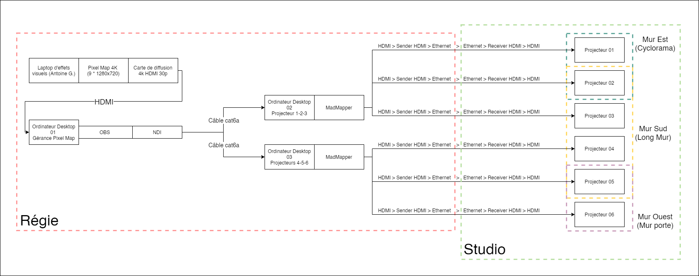
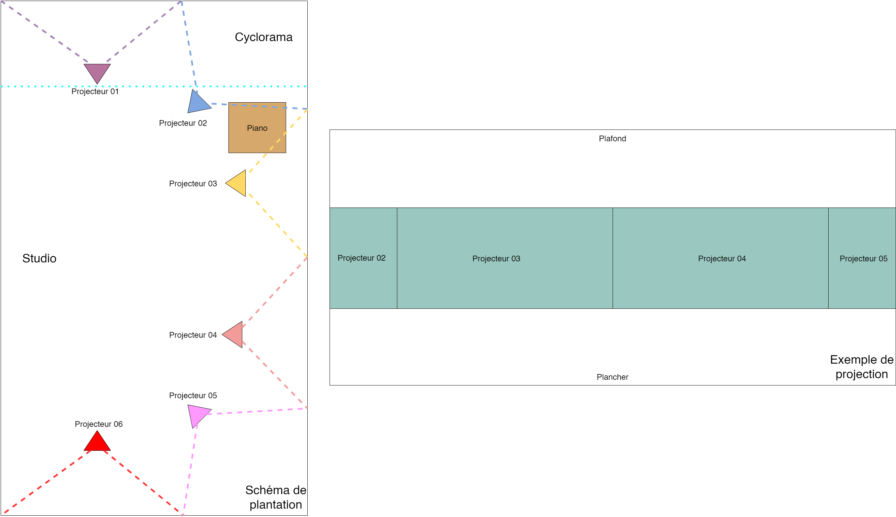

# Direction technique (Plans, schémas et équipements)

## Nature du projet

Descritpion des effets visuels recherchés

## Schéma de branchement

## Schéma de plantation

## Liste des équipements

## Horaire d'implantation pour les tests