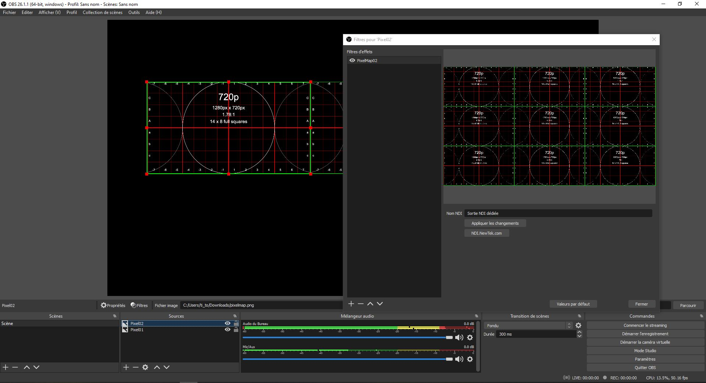
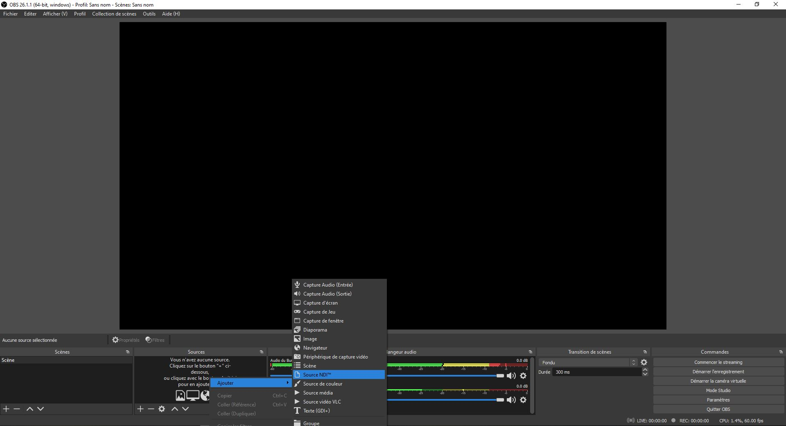
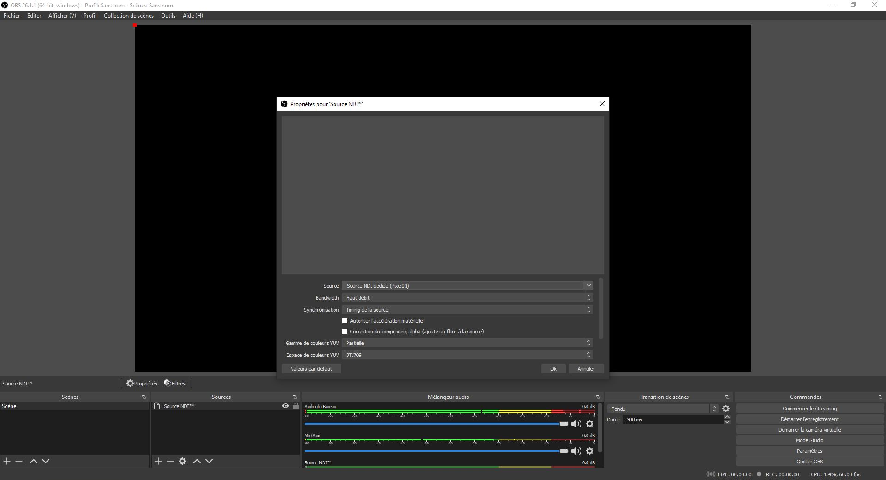

# Direction technique (Plans, schémas et équipements)

## Nature du projet

Descritpion des effets visuels recherchés

## Schéma de branchement

## Fonctionnement

L'ordinateur qui génère les effets visuels envoie de 1 à 9 sorties vidéos (6 dans notre cas) vers un Pixel Map en format 4K divisé en neuf espaces symétriques de 1280 x 720. Une fois le Pixel Map remplit selon les désirs du créateur, la source est envoyé vers une carte de capture 4K 30fps, puis vers un deuxième ordinateur qui s'occupera de séparer le Pixel Map. 

Sur cet ordinateur, dans OBS, il suffit de créer six instances du Pixel Map à partir de la source reçu de la carte 4K 30fps. 

Ensuite avec le raccourci ctrl + e, rogner dans chaque source, une vidéo du Pixel Map différent jusqu'à avoir toutes les vidéos individuellement séparées.

Il faut savoir qu'un ordinateur peut seulement s'occuper de maximum trois projecteurs, faute de prises HDMI/DP. Ensuite, avec NDI, sur OBS, deux options s'offrent à nous. Si les vidéos n'ont pas besoin de vidéo mapping, il est possible de grouper les trois vidéos avec les offsets désirés en amont et d'envoyer le groupe complet, via un filtre NDI en effectuant un click droit sur le groupe et en ajoutant un filtre NDI dédié, vers l'ordinateur qui s'occupe des trois projecteurs désirés. 
 

Par contre, si les vidéos doivent passer par MadMapper, il serait mieux que les trois vidéos soient séparées, donc au lieu de grouper les vidéos, il suffit de ne pas grouper les différentes sources et de leur appliquer chacun un filtre NDI dédié unique, et d'envoyer les vidéos indépendemment vers l'ordinateur souhaité.

Pour le transfert vers l'ordinateur qui s'occupe des projections, il est important que les deux ordianteurs soient sur le même réseau pour que NDI fonctionne. Donc sur l'instance OBS qui doit recevoir les vidéos, il suffit d'ajouter une source NDI avec comme source vidéo le filtre NDI dédié du vidéo voulu. Puis il suffit de répéter cette opération avec les trois filtres différents.

Pour finir, dans MadMapper il suffit de choisir la source vidéo selon le nom donné à celle-ci dans OBS pour que le vidéo soit récupéré sur l'interface de MadMapper et puisse être modifié et placé par le logiciel.

## Schéma de plantation

## Liste des équipements

Vidéo : 

- 6 Projecteurs short throw, ratio 0.5, 3000 lumens

- 3 Ordinateurs Desktop

Audio :

Lumières : 

- 1 Chauvet DJ EVE E-100Z 100W Warm White Ellipsoidal Spot 

Câbles et cartes :

- 1 Carte de capture HDMI 4K 30FPS

- 6 Extender réseau HDMI

- 14 câbles cat6a Ethernet 10'

- 9 câbles HDMI 8'

- 4 câble HDMI to Display Port

- 2 câble XLR 10'

- 1 XLR to USB

Autre :

- 6 systèmes d'accrochage pour projecteurs

- 7 câbles de sécurité

Logiciels : 

- OBS + NDI

- MadMapper

- Pixel Map 4K séparé en 9 * 1280 x 720

## Horaire d'implantation pour les tests

Lundi 17 mai : Récupération du Matériel, accrochage et branchement.

Mardi 18 mai : Mise en place des logiciels et tests de transmission.

Mardi 25 mai : Mise en place du haut parleur et pauffinement.

Mercredi 26 mai : Premiers tests avec Antoine Gaudreau pour les effets visuels.

Jeudi 27 mai : Continuité des tests et démontage du matériel.