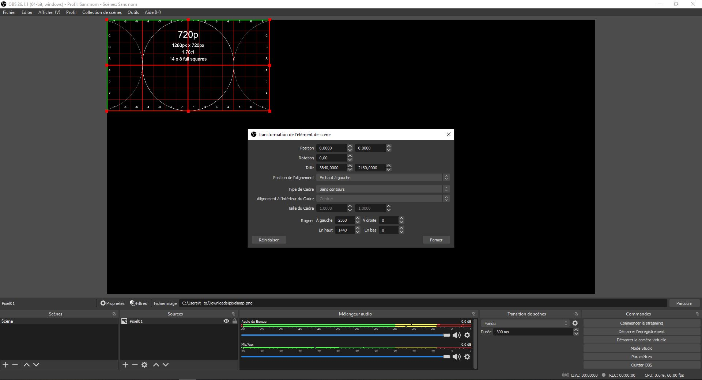

# Direction technique (Plans, schémas et équipements)

## Nature du projet

Descritpion des effets visuels recherchés

## Schéma de branchement

Fonctionnement : L'ordinateur qui génère les effets visuels envoie de 1 à 9 sorties vidéos (6 dans notre cas) vers un Pixel Map en format 4K divisé en 9 espaces symétriques de 1280x720. Une fois le Pixel Map remplit selon les désirs du créateur, la source est envoyé vers une carte de capture 4K 30fps, puis vers un deuxième ordinateur qui s'occupera de séparer le Pixel Map. 

Sur cet ordinateur, dans OBS, il suffit de créer 6 instances du Pixel Map à partir de la source reçu de la carte 4K 30fps. 

Ensuite avec le raccourci ctrl + e, rogner dans chaque source, un vidéo du Pixel Map différent jusqu'à avoir tous les vidéos individuellement séparés.

Il faut savoir qu'un ordinateur peut seulement s'occupper de maximum trois projecteurs, faute de prises HDMI/DP. Ensuite, avec NDI, sur OBS, deux options s'offrent à nous. Si les vidéos n'ont pas besoin de vidéo mapping il est possible de grouper les 3 vidéos avec les offsets désirés en amont et d'envoyer le groupe complet, via un filtre NDI en effectuant un click droit sur le groupe et en ajoutant un filtre NDI dédié, vers l'ordinateur qui s'occupe des trois projecteurs désirés. 
 

Par contre, si les vidéos doivent passer par MadMapper, il serait mieux que les trois vidéos soient séparés, donc au lieu de grouper les vidéos, il suffit de créer trois dedicated output NDI différents, et d'envoyer les vidéos indépendemment vers l'ordinateur souhaité. 

## Schéma de plantation

## Liste des équipements

Vidéo : 

Audio :

Lumières : 

Câbles et cartes :

Autre :

## Horaire d'implantation pour les tests

